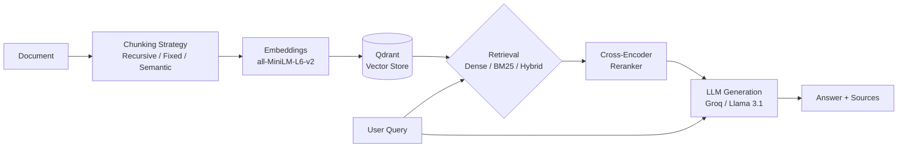

# RAG Experiment Lab

A hands-on experimentation framework for comparing RAG (Retrieval-Augmented Generation) strategies — swap chunking and retrieval methods, run experiments, and compare results side by side.

---

## What It Does

Most RAG tutorials show one approach. This project lets you **compare them all** on the same document and measure which combination actually performs better.

---

## Tech Stack

| Layer | Tools |
|-------|-------|
| **Orchestration** | LangChain |
| **LLM** | Groq (Llama 3.1) |
| **Vector Store** | Qdrant (Docker) |
| **Embeddings** | sentence-transformers/all-MiniLM-L6-v2 |
| **Evaluation** | RAGAS |
| **API** | FastAPI |
| **UI** | Flask |

---

## Chunking Strategies

| Strategy | Description |
|----------|-------------|
| `recursive` | Splits on natural boundaries — paragraphs, sentences, words |
| `fixed_256` / `fixed_512` / `fixed_1024` | Cuts at exact character count |
| `semantic_percentile` | Cuts where embedding similarity drops (topic boundaries) |
| `semantic_std` | Semantic splitting with standard deviation threshold |

---

## Retrieval Methods

| Method | Description |
|--------|-------------|
| `dense` | Pure vector similarity search via Qdrant |
| `bm25` | Keyword-based scoring |
| `hybrid` | BM25 + Dense → RRF Fusion → Cross-encoder Reranking |

---

## Architecture



---

## Getting Started

### Prerequisites
- Python 3.10+
- Docker Desktop

### Setup

```bash
# Clone the repo
git clone https://github.com/Sejwanipunit/rag-pipeline_prod.git
cd rag-pipeline_prod

# Create virtual environment
python -m venv venv
source venv/Scripts/activate  # Windows

# Install dependencies
pip install -r requirements.txt

# Set up environment variables
cp .env.example .env
# Add your GROQ_API_KEY to .env
```

### Start Qdrant

```bash
docker run -d --name qdrant -p 6333:6333 --restart always qdrant/qdrant
```

### Ingest Documents

```bash
# Add your PDFs to data/docs/
python ingest.py
```

### Run the UI

```bash
python flask_ui/server.py
# Open http://localhost:5001
```

---

## Running Experiments

Via the Flask UI at `http://localhost:5001`:

1. Select a chunking strategy
2. Select a retrieval method
3. Enter test queries
4. Click **Run Experiment**

Results are saved to `experiments/results/` and compared at `/results`.

---

## Key Findings

| Strategy | Context Recall | Avg Latency |
|----------|---------------|-------------|
| Fixed 512 + Dense | 0.76 | 2.1s |
| Recursive + BM25 | 0.81 | 1.8s |
| Recursive + Hybrid | 0.86 | 6.8s |
| Semantic + Hybrid | 0.89 | 8.2s |

> Hybrid search with cross-encoder reranking consistently outperformed single-strategy retrieval.

---

## Project Structure

```
rag-pipeline/
├── app/
│   ├── ingestion/
│   │   ├── chunking/       # Fixed, Recursive, Semantic strategies
│   │   ├── embedder.py
│   │   └── loader.py
│   ├── retrieval/          # Dense, BM25, Hybrid + Reranker
│   └── generation/         # LLM chain with prompt template
├── experiments/
│   ├── runner.py           # Experiment orchestrator
│   └── results/            # Saved JSON results
├── evaluation/             # RAGAS metrics
├── flask_ui/               # Experiment UI
└── data/docs/              # Your documents go here
```
